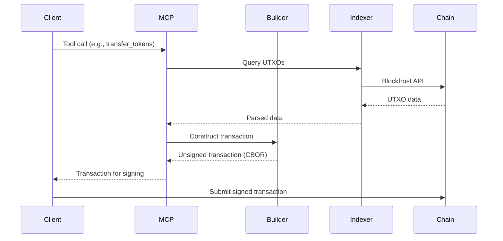

# UltraLife Protocol API Reference

> **Status: Development Complete** — Now deploying to Cardano Preview Testnet.

This document describes the transaction formats, datum structures, and MCP endpoints for interacting with the UltraLife Protocol.

## Table of Contents

1. [Overview](#overview)
2. [Transaction Formats](#transaction-formats)
3. [Datum Structures](#datum-structures)
4. [Redeemer Structures](#redeemer-structures)
5. [MCP Tools](#mcp-tools)
6. [Error Codes](#error-codes)

---

## Overview

### Interaction Model



### Base Types

All UltraLife transactions use these common types:

| Type | Encoding | Description |
|------|----------|-------------|
| `ByteArray` | Hex string | Raw bytes (e.g., policy IDs, hashes) |
| `Int` | Integer | Signed 64-bit integer |
| `VerificationKeyHash` | Hex (28 bytes) | Wallet public key hash |
| `AssetName` | Hex string | Token name within policy |
| `PolicyId` | Hex (28 bytes) | Minting policy hash |

---

## Transaction Formats

### Identity Transactions

#### Mint pNFT

Creates a new personal NFT identity.

**Validator**: `pnft.ak`
**Redeemer**: `Mint`

```json
{
  "transaction": {
    "inputs": [
      {
        "tx_hash": "abc123...",
        "output_index": 0,
        "note": "User's ADA UTxO for fees"
      }
    ],
    "outputs": [
      {
        "address": "addr_...",
        "value": {
          "lovelace": 2000000,
          "pnft_policy.user_pnft_id": 1
        },
        "datum": {
          "pnft_id": "user_pnft_id",
          "owner": "verification_key_hash",
          "level": "Basic",
          "bioregion": null,
          "dna_hash": null,
          "guardian": null,
          "created_at": 12345678,
          "upgraded_at": null,
          "consumer_impact": null
        }
      }
    ],
    "mint": {
      "pnft_policy.user_pnft_id": 1
    },
    "redeemer": {
      "type": "Mint",
      "data": {}
    }
  }
}
```

#### Upgrade pNFT Level

Upgrades verification level (e.g., Basic → Standard).

**Validator**: `pnft.ak`
**Redeemer**: `Upgrade { new_level, evidence_hash }`

```json
{
  "transaction": {
    "inputs": [
      {
        "note": "Existing pNFT UTxO",
        "datum": { "level": "Basic", "..." : "..." }
      }
    ],
    "outputs": [
      {
        "datum": {
          "level": "Standard",
          "dna_hash": "dna_verification_hash",
          "upgraded_at": 12345679
        }
      }
    ],
    "redeemer": {
      "type": "Upgrade",
      "new_level": "Standard",
      "evidence_hash": "dna_lab_attestation_hash"
    }
  }
}
```

---

### Token Transactions

#### Transfer Tokens

Every token transfer requires identity verification and impact declaration.

**Validator**: `token.ak`
**Redeemer**: `Transfer`

```json
{
  "transaction": {
    "inputs": [
      {
        "note": "Sender token UTxO",
        "value": { "lovelace": 2000000, "ultra_policy.ULTRA": 1000 }
      },
      {
        "note": "Sender pNFT (reference input)",
        "datum": { "pnft_id": "sender_pnft", "level": "Standard" }
      }
    ],
    "reference_inputs": [
      {
        "note": "Recipient pNFT verification",
        "datum": { "pnft_id": "recipient_pnft", "level": "Basic" }
      }
    ],
    "outputs": [
      {
        "address": "recipient_address",
        "value": { "lovelace": 2000000, "ultra_policy.ULTRA": 100 },
        "datum": {
          "sender_pnft": "sender_pnft_id",
          "recipient_pnft": "recipient_pnft_id",
          "transaction_type": "Services",
          "impact_declaration": {
            "compounds": [
              { "compound": "0x0101", "quantity": -50, "unit": "Grams" }
            ],
            "evidence_hash": "attestation_hash"
          }
        }
      },
      {
        "note": "Change back to sender",
        "address": "sender_address",
        "value": { "lovelace": 1500000, "ultra_policy.ULTRA": 900 }
      }
    ],
    "redeemer": {
      "type": "Transfer",
      "data": {}
    }
  }
}
```

**Transaction Types:**

| Category | Types |
|----------|-------|
| Primary | `Labor`, `Agriculture`, `Harvest` |
| Secondary | `Goods`, `Manufactured`, `Construction`, `Energy` |
| Tertiary | `Services`, `Healthcare`, `Education`, `Transport`, `Hospitality`, `Rental`, `Insurance` |
| Quaternary | `Research`, `Data`, `License` |
| Quinary | `Care`, `CommunityService` |
| Financial | `Gift`, `Investment`, `LoanRepayment`, `Remediation`, `UBI`, `GovernanceReward`, `Internal` |

---

### Treasury Transactions

#### Buy Tokens (ADA → ULTRA)

**Validator**: `treasury.ak`
**Redeemer**: `Buy { amount }`

```json
{
  "transaction": {
    "inputs": [
      {
        "note": "Treasury UTxO",
        "value": { "lovelace": 1000000000000, "ultra_policy.ULTRA": 400000000000 }
      },
      {
        "note": "Buyer ADA",
        "value": { "lovelace": 100000000 }
      },
      {
        "note": "Buyer pNFT (reference)",
        "datum": { "pnft_id": "buyer_pnft" }
      }
    ],
    "outputs": [
      {
        "note": "Updated treasury",
        "value": { "lovelace": 1100000000, "ultra_policy.ULTRA": 399999999000 }
      },
      {
        "note": "Buyer receives ULTRA",
        "address": "buyer_address",
        "value": { "lovelace": 2000000, "ultra_policy.ULTRA": 1000 }
      }
    ],
    "redeemer": {
      "type": "Buy",
      "amount": 1000
    }
  }
}
```

**Price Calculation:**
```
price_per_token = distributed_tokens / 400,000,000,000 USD
ada_required = amount * price_per_token * ada_usd_rate
```

#### Sell Tokens (ULTRA → ADA)

**Validator**: `treasury.ak`
**Redeemer**: `Sell { amount }`

```json
{
  "redeemer": {
    "type": "Sell",
    "amount": 1000
  }
}
```

**Note**: Sell price is 90% of buy price (10% spread).

---

### Marketplace Transactions

#### Create Listing

**Validator**: `marketplace.ak`
**Redeemer**: `List`

```json
{
  "transaction": {
    "outputs": [
      {
        "address": "marketplace_script_address",
        "value": { "lovelace": 2000000 },
        "datum": {
          "listing_id": "unique_listing_id",
          "seller_pnft": "seller_pnft_id",
          "listing_type": "Product",
          "title_hash": "ipfs_content_hash",
          "price": 50,
          "impact_disclosure": {
            "compounds": [
              { "compound": "0x0101", "quantity": 100, "unit": "Grams" }
            ]
          },
          "bioregion": "bioregion_id",
          "created_at": 12345678,
          "status": "Active"
        }
      }
    ],
    "redeemer": {
      "type": "List"
    }
  }
}
```

**Listing Types:**
- `Product` - Physical goods
- `Service` - Labor/skills
- `WorkCapacity` - Available for work auction
- `AssetSale` - One-time asset transfer
- `AssetRental` - Temporary asset use

#### Purchase Listing

**Validator**: `marketplace.ak`
**Redeemer**: `Buy { listing_id }`

```json
{
  "transaction": {
    "inputs": [
      { "note": "Listing UTxO" },
      { "note": "Buyer tokens" },
      { "note": "Buyer pNFT (reference)" }
    ],
    "outputs": [
      { "note": "Tokens to seller" },
      { "note": "Fee to UBI pool" },
      { "note": "Impact transfers to buyer pNFT" }
    ],
    "redeemer": {
      "type": "Buy",
      "listing_id": "listing_id"
    }
  }
}
```

---

### Governance Transactions

#### Create Proposal

**Validator**: `governance.ak`
**Redeemer**: `Propose`

```json
{
  "transaction": {
    "outputs": [
      {
        "address": "governance_script_address",
        "datum": {
          "proposal_id": "unique_proposal_id",
          "proposer": "proposer_pnft_id",
          "bioregion": "bioregion_id",
          "proposal_type": {
            "type": "Budget",
            "amount": 10000,
            "recipient": "recipient_address_hash"
          },
          "content_hash": "ipfs_proposal_details",
          "voting_start": 12345678,
          "voting_end": 15542478,
          "votes_for": 0,
          "votes_against": 0,
          "status": "Active"
        }
      }
    ],
    "redeemer": { "type": "Propose" }
  }
}
```

**Proposal Types:**
```json
{ "type": "Budget", "amount": 10000, "recipient": "hash" }
{ "type": "Policy", "policy_hash": "hash" }
{ "type": "Emergency", "action_hash": "hash" }
{ "type": "Constitutional", "amendment_hash": "hash" }
```

**Voting Periods:**
- Normal: 37 days (1 cycle)
- Emergency: 3.7 days (0.1 cycle)
- Constitutional: 74 days (2 cycles)

#### Cast Vote

**Validator**: `governance.ak`
**Redeemer**: `Vote { proposal_id, support }`

```json
{
  "redeemer": {
    "type": "Vote",
    "proposal_id": "proposal_id",
    "support": true
  }
}
```

**Vote Weight by Level:**
| Level | Weight |
|-------|--------|
| Basic | 0 (cannot vote) |
| Ward | 0 (cannot vote) |
| Standard | 1 |
| Verified | 2 |
| Steward | 3 |

---

### UBI Transactions

#### Claim UBI

**Validator**: `ubi.ak`
**Redeemer**: `Claim { cycle }`

```json
{
  "transaction": {
    "inputs": [
      {
        "note": "UBI pool UTxO for cycle",
        "datum": {
          "bioregion": "bioregion_id",
          "cycle": 42,
          "ubi_pool": 100000,
          "eligible_count": 500,
          "total_engagement_weight": 750
        }
      },
      { "note": "Claimer pNFT (reference)" }
    ],
    "outputs": [
      {
        "note": "UBI claim record",
        "datum": {
          "pnft": "claimer_pnft_id",
          "cycle": 42,
          "base_share": 200,
          "engagement_mult": 12000,
          "amount": 240,
          "slot": 12345678
        }
      },
      {
        "note": "Tokens to claimer",
        "value": { "ultra_policy.ULTRA": 240 }
      }
    ],
    "redeemer": {
      "type": "Claim",
      "cycle": 42
    }
  }
}
```

**UBI Calculation:**
```
base_share = ubi_pool / eligible_count
engagement_mult = individual_engagement / average_engagement
final_amount = base_share * engagement_mult
survival_floor = max(20, final_amount)
```

---

### Impact Transactions

#### Mint Impact Token

**Validator**: `impact.ak`
**Redeemer**: `Mint { category, compounds }`

```json
{
  "transaction": {
    "mint": {
      "impact_policy.carbon_credit_001": 1
    },
    "outputs": [
      {
        "datum": {
          "impact_id": "carbon_credit_001",
          "category": "Carbon",
          "creator_pnft": "creator_pnft_id",
          "compounds": [
            {
              "compound": "0x0101",
              "quantity": -1000,
              "unit": "Kilograms",
              "measurement": "Surveyed",
              "confidence": 95
            }
          ],
          "attestations": [
            { "attester": "surveyor_pnft", "slot": 12345678 }
          ],
          "created_at": 12345678,
          "status": "Active"
        }
      }
    ],
    "redeemer": {
      "type": "Mint",
      "category": "Carbon",
      "compounds": [...]
    }
  }
}
```

**Impact Categories:**
- `Carbon` - CO2, CH4, CO
- `Water` - H2O consumption/pollution
- `Biodiversity` - Species impact
- `Soil` - Erosion, contamination
- `Air` - Particulates, NOx, SOx
- `Waste` - Solid, hazardous
- `Energy` - Consumption, generation
- `LandUse` - Deforestation, restoration

#### Retire Impact Token

**Validator**: `impact.ak`
**Redeemer**: `Retire { impact_id, consumer_pnft }`

```json
{
  "redeemer": {
    "type": "Retire",
    "impact_id": "carbon_credit_001",
    "consumer_pnft": "consumer_pnft_id"
  }
}
```

Impact compounds are transferred to consumer's impact record.

---

## Datum Structures

### PnftDatum

```aiken
pub type PnftDatum {
  pnft_id: ByteArray,
  owner: VerificationKeyHash,
  level: VerificationLevel,
  bioregion: Option<ByteArray>,
  dna_hash: Option<ByteArray>,
  guardian: Option<AssetName>,
  ward_since: Option<Int>,
  created_at: Int,
  upgraded_at: Option<Int>,
  consumer_impact: Option<ConsumerImpactRecord>,
  nutrition_profile: Option<NutritionProfile>,
}
```

### BioregionDatum

```aiken
pub type BioregionDatum {
  bioregion_id: ByteArray,
  name_hash: ByteArray,
  bounds_hash: ByteArray,
  health_index: Int,
  resident_count: Int,
  treasury: ByteArray,
  created_at: Int,
  last_health_update: Int,
}
```

### TransferDatum

```aiken
pub type TransferDatum {
  sender_pnft: AssetName,
  recipient_pnft: AssetName,
  transaction_type: TransactionType,
  impact_declaration: ImpactDeclaration,
  evidence_hash: Option<ByteArray>,
  slot: Int,
}
```

### CompoundFlow

```aiken
pub type CompoundFlow {
  compound: CompoundCode,
  quantity: Int,
  unit: MassUnit,
  measurement: MeasurementMethod,
  confidence: Int,
}
```

### ConsumerImpactRecord

```aiken
pub type ConsumerImpactRecord {
  lifetime_compounds: List<CompoundBalance>,
  remediated_compounds: List<CompoundBalance>,
  unremediated_compounds: List<CompoundBalance>,
  last_updated: Int,
}
```

---

## Redeemer Structures

### pNFT Redeemers

```aiken
pub type PnftRedeemer {
  Mint
  Upgrade { new_level: VerificationLevel, evidence_hash: ByteArray }
  UpdateBioregion { bioregion: ByteArray }
  SetGuardian { guardian_pnft: AssetName }
  Recover { recovery_type: RecoveryType, evidence: ByteArray }
}
```

### Token Redeemers

```aiken
pub type TokenRedeemer {
  Transfer
  Burn { amount: Int }
}
```

### Governance Redeemers

```aiken
pub type GovernanceRedeemer {
  Propose
  Vote { proposal_id: ByteArray, support: Bool }
  Execute { proposal_id: ByteArray }
  Cancel { proposal_id: ByteArray }
}
```

### Marketplace Redeemers

```aiken
pub type MarketplaceRedeemer {
  List
  Buy { listing_id: ByteArray }
  Cancel { listing_id: ByteArray }
  Update { listing_id: ByteArray, new_price: Int }
}
```

---

## MCP Tools

The MCP service provides 31 tools for LLM interaction.

### Identity Tools

| Tool | Description | Parameters |
|------|-------------|------------|
| `create_pnft` | Mint new identity | `owner_address` |
| `upgrade_pnft` | Upgrade verification level | `pnft_id`, `new_level`, `evidence` |
| `get_pnft` | Query pNFT data | `pnft_id` |
| `find_pnft_by_owner` | Find pNFT for address | `address` |

### Token Tools

| Tool | Description | Parameters |
|------|-------------|------------|
| `transfer_tokens` | Send tokens with impact | `recipient`, `amount`, `type`, `impact` |
| `get_balance` | Query token balance | `address` |
| `get_transfer_history` | List transfers | `pnft_id`, `limit` |

### Treasury Tools

| Tool | Description | Parameters |
|------|-------------|------------|
| `buy_tokens` | ADA to ULTRA | `ada_amount` |
| `sell_tokens` | ULTRA to ADA | `ultra_amount` |
| `get_price` | Current token price | - |
| `get_treasury_stats` | Treasury state | - |

### Marketplace Tools

| Tool | Description | Parameters |
|------|-------------|------------|
| `create_listing` | Post item for sale | `type`, `title`, `price`, `impact` |
| `buy_listing` | Purchase listing | `listing_id` |
| `search_listings` | Find listings | `query`, `type`, `bioregion` |
| `cancel_listing` | Remove listing | `listing_id` |

### Governance Tools

| Tool | Description | Parameters |
|------|-------------|------------|
| `create_proposal` | Submit proposal | `type`, `content`, `bioregion` |
| `vote` | Cast vote | `proposal_id`, `support` |
| `get_proposals` | List active proposals | `bioregion`, `status` |
| `execute_proposal` | Execute passed proposal | `proposal_id` |

### UBI Tools

| Tool | Description | Parameters |
|------|-------------|------------|
| `claim_ubi` | Claim cycle distribution | `cycle` |
| `get_ubi_status` | Check eligibility | `pnft_id`, `cycle` |
| `get_cycle_stats` | Cycle economics | `cycle`, `bioregion` |

### Impact Tools

| Tool | Description | Parameters |
|------|-------------|------------|
| `create_impact` | Mint impact token | `category`, `compounds` |
| `retire_impact` | Apply to consumer | `impact_id`, `consumer_pnft` |
| `get_impact_balance` | Consumer impact record | `pnft_id` |
| `search_impact_market` | Find impact tokens | `category`, `min_quantity` |

### Bioregion Tools

| Tool | Description | Parameters |
|------|-------------|------------|
| `get_bioregion` | Query bioregion data | `bioregion_id` |
| `list_bioregions` | All bioregions | - |
| `get_bioregion_health` | Health metrics | `bioregion_id` |

---

## Error Codes

### Validation Errors

| Code | Name | Description |
|------|------|-------------|
| `E001` | `PNFT_NOT_FOUND` | Required pNFT not in inputs |
| `E002` | `PNFT_NOT_OWNER` | Signer not pNFT owner |
| `E003` | `INSUFFICIENT_LEVEL` | Verification level too low |
| `E004` | `NO_BIOREGION` | pNFT not assigned to bioregion |
| `E005` | `BIOREGION_MISMATCH` | Wrong bioregion for action |

### Token Errors

| Code | Name | Description |
|------|------|-------------|
| `E101` | `INSUFFICIENT_BALANCE` | Not enough tokens |
| `E102` | `INVALID_RECIPIENT` | Recipient pNFT not found |
| `E103` | `EMPTY_IMPACT` | Impact declaration required |
| `E104` | `INVALID_TX_TYPE` | Unknown transaction type |

### Treasury Errors

| Code | Name | Description |
|------|------|-------------|
| `E201` | `INSUFFICIENT_ADA` | Not enough ADA for purchase |
| `E202` | `INSUFFICIENT_TREASURY` | Treasury depleted |
| `E203` | `PRICE_SLIPPAGE` | Price changed during tx |

### Governance Errors

| Code | Name | Description |
|------|------|-------------|
| `E301` | `VOTING_CLOSED` | Voting period ended |
| `E302` | `ALREADY_VOTED` | Duplicate vote |
| `E303` | `QUORUM_NOT_MET` | 37% participation required |
| `E304` | `PROPOSAL_NOT_PASSED` | Cannot execute failed proposal |

### UBI Errors

| Code | Name | Description |
|------|------|-------------|
| `E401` | `ALREADY_CLAIMED` | UBI already claimed for cycle |
| `E402` | `CYCLE_NOT_COMPLETE` | Cycle still active |
| `E403` | `NOT_ELIGIBLE` | pNFT not eligible for UBI |

### Impact Errors

| Code | Name | Description |
|------|------|-------------|
| `E501` | `INVALID_COMPOUND` | Unknown compound code |
| `E502` | `ATTESTATION_REQUIRED` | Impact needs verification |
| `E503` | `ALREADY_RETIRED` | Impact token already used |

---

## Rate Limits and Constraints

### Transaction Constraints

| Constraint | Value |
|------------|-------|
| Max inputs per transaction | 50 |
| Max outputs per transaction | 50 |
| Max datum size | 16 KB |
| Max transaction size | 16 KB |

### Economic Constraints

| Constraint | Value |
|------------|-------|
| Min transfer amount | 1 token |
| Min listing price | 1 token |
| Max proposal duration | 74 days (constitutional) |
| Min voting period | 3.7 days (emergency) |

### Cycle Constraints

| Constraint | Value |
|------------|-------|
| Cycle duration | 3,196,800 slots (37 days) |
| UBI claim window | Current cycle only |
| Proposal execution window | 7 days after passing |

---

## Related Documentation

- [Architecture](ARCHITECTURE.md) - System design overview
- [Getting Started](GETTING_STARTED.md) - Developer onboarding
- [Implementation Spec](IMPLEMENTATION_SPEC.md) - Detailed specifications
- [Oracle Specification](ORACLE_SPECIFICATION.md) - External data feeds
