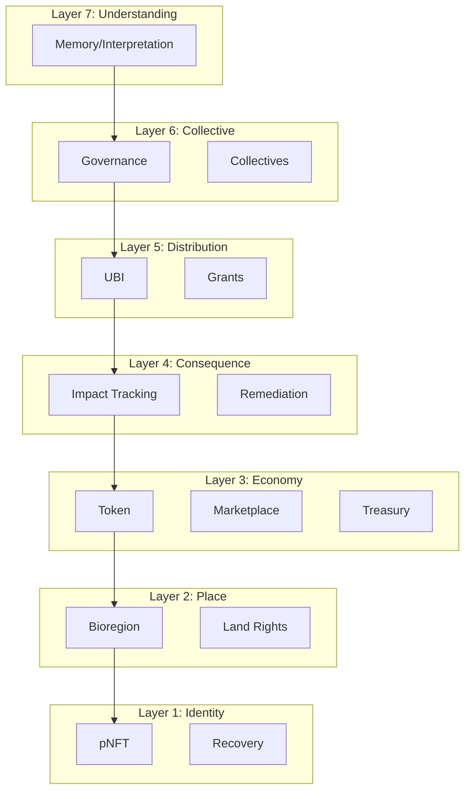
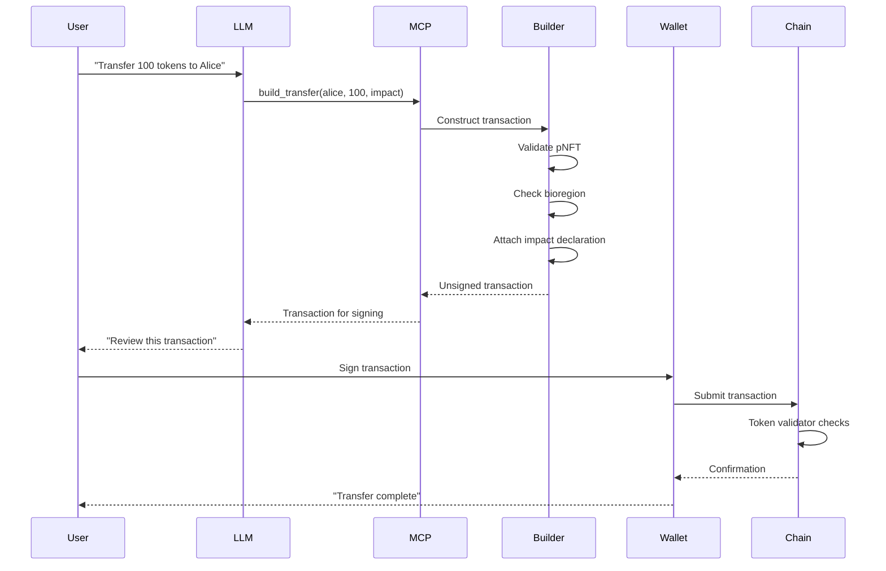
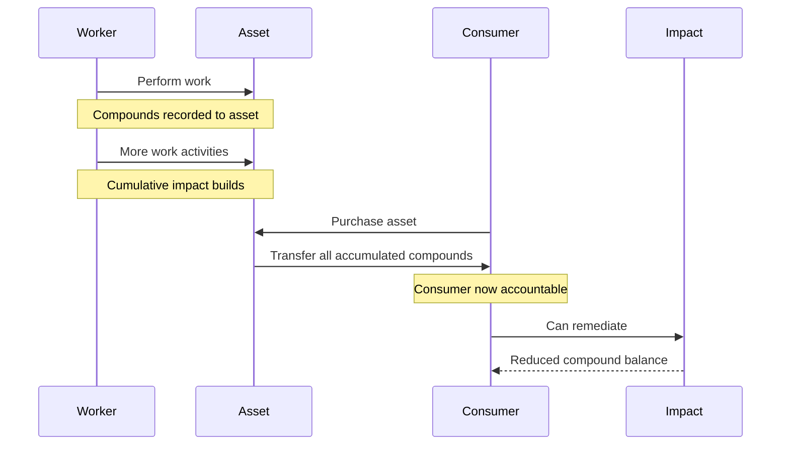
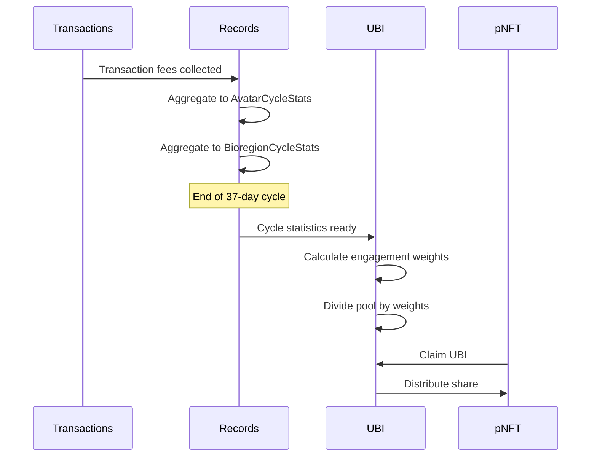
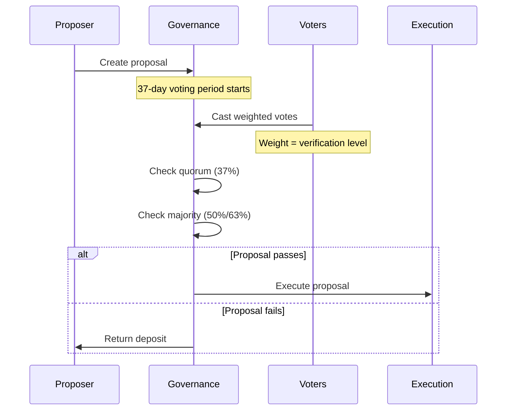
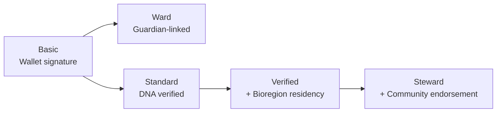
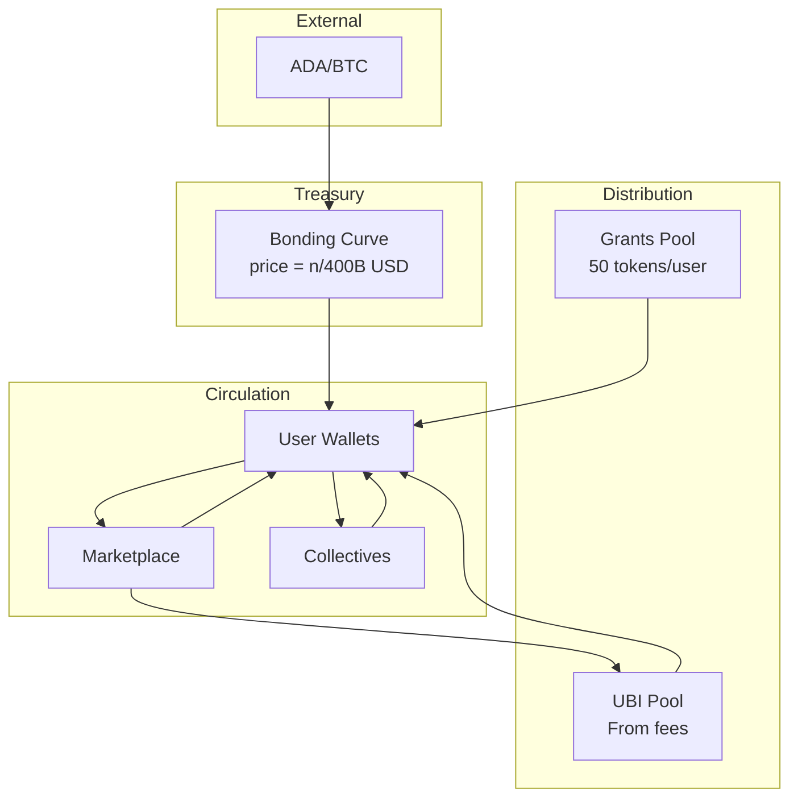
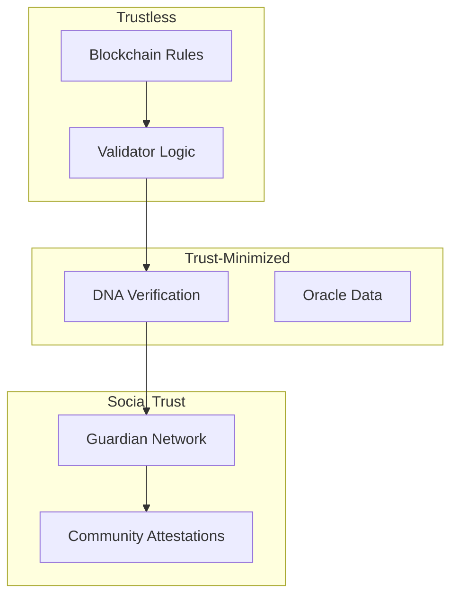
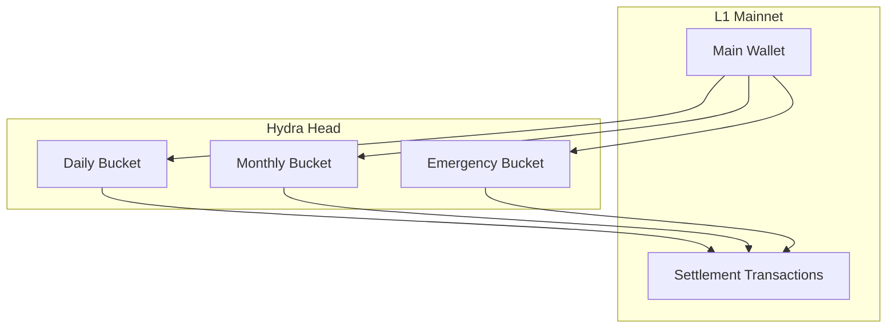

# UltraLife Protocol Architecture

> **Status: Development Complete** — Now deploying to Cardano Preview Testnet.

This document provides a comprehensive overview of the UltraLife Protocol system design, validator interactions, and data flows.

## Table of Contents

1. [System Overview](#system-overview)
2. [The Seven Layers](#the-seven-layers)
3. [Validator Architecture](#validator-architecture)
4. [Data Flow Diagrams](#data-flow-diagrams)
5. [Type System](#type-system)
6. [Economic Flows](#economic-flows)
7. [Security Model](#security-model)

---

## System Overview

UltraLife Protocol is a regenerative economics system built on Cardano using Aiken smart contracts. The protocol operates through 27 validators that work together to create a complete economic system.

### High-Level Architecture

```mermaid
graph TB
    subgraph "User Interface Layer"
        User[User]
        LLM[LLM Assistant]
        Wallet[Cardano Wallet]
    end

    subgraph "Service Layer"
        MCP[MCP Server]
        Indexer[Blockfrost Indexer]
        Builder[Transaction Builder]
    end

    subgraph "Blockchain Layer"
        subgraph "Identity"
            pNFT[pNFT Validator]
            Recovery[Recovery Validator]
        end

        subgraph "Economy"
            Token[Token Validator]
            Treasury[Treasury Validator]
            UBI[UBI Validator]
        end

        subgraph "Geography"
            Bioregion[Bioregion Validator]
            Land[Land Rights Validator]
            Commons[Commons Validator]
        end

        subgraph "Impact"
            Impact[Impact Validator]
            ImpactMarket[Impact Market]
            AssetImpact[Asset Impact]
            Remediation[Remediation]
        end
    end

    User --> LLM
    LLM --> MCP
    MCP --> Builder
    MCP --> Indexer
    Builder --> Wallet
    Wallet --> Token
    Indexer --> Token
```

### Core Design Principles

1. **Identity-First**: Every action requires a verified pNFT
2. **Impact Transparency**: Every transaction declares compound flows
3. **Bioregional Organization**: Geography based on ecology, not politics
4. **Consumer Accountability**: Impact flows to the end consumer
5. **No Chokepoints**: Fully decentralized at every layer

---

## The Seven Layers

The protocol is organized into seven conceptual layers:



| Layer | Purpose | Key Validators |
|-------|---------|----------------|
| 1. Identity | One per human, DNA-verified | pnft, recovery |
| 2. Place | Ecological boundaries | bioregion, land_rights, commons |
| 3. Economy | Value exchange | token, treasury, marketplace, work_auction |
| 4. Consequence | Impact measurement | impact, impact_market, asset_impact, remediation |
| 5. Distribution | Resource allocation | ubi, grants |
| 6. Collective | Group coordination | governance, collective, care |
| 7. Understanding | Emergent meaning | memory, registry |

---

## Validator Architecture

### Validator Dependency Graph

```mermaid
graph LR
    subgraph "Foundation"
        pNFT[pNFT]
        Genesis[Genesis]
    end

    subgraph "Geography"
        Bioregion[Bioregion]
        Land[Land Rights]
        Commons[Commons]
    end

    subgraph "Economy"
        Token[Token]
        Treasury[Treasury]
        Grants[Grants]
    end

    subgraph "Market"
        Marketplace[Marketplace]
        WorkAuction[Work Auction]
        Records[Records]
    end

    subgraph "Impact"
        Impact[Impact]
        ImpactMarket[Impact Market]
        AssetImpact[Asset Impact]
        Remediation[Remediation]
    end

    subgraph "Distribution"
        UBI[UBI]
        Governance[Governance]
    end

    subgraph "Organization"
        Collective[Collective]
        Care[Care]
    end

    Genesis --> pNFT
    pNFT --> Bioregion
    pNFT --> Token
    Bioregion --> Land
    Bioregion --> Commons
    Bioregion --> Governance
    Token --> Marketplace
    Token --> WorkAuction
    Token --> UBI
    Marketplace --> Records
    WorkAuction --> AssetImpact
    AssetImpact --> Impact
    Impact --> ImpactMarket
    Impact --> Remediation
    pNFT --> Collective
    Collective --> Care
    Records --> UBI
    Treasury --> Token
    Grants --> Token
```

### Validator Categories

#### Identity Validators

| Validator | Dependencies | Produces | Consumes |
|-----------|--------------|----------|----------|
| pNFT | Genesis (bootstrap) | pNFT tokens | Genesis authorization |
| Recovery | pNFT | Recovery requests | Guardian signatures, DNA verification |

#### Geographic Validators

| Validator | Dependencies | Produces | Consumes |
|-----------|--------------|----------|----------|
| Bioregion | pNFT (Steward level) | Bioregion beacons | Steward authorization |
| Land Rights | Bioregion, pNFT | Land stewardship records | Bioregion assignment |
| Commons | Bioregion, Collective | Commons allocations | Treasury funds |

#### Economy Validators

| Validator | Dependencies | Produces | Consumes |
|-----------|--------------|----------|----------|
| Token | pNFT, Bioregion | Token transfers | Impact declarations |
| Treasury | Token | ULTRA tokens | ADA/BTC deposits |
| Grants | pNFT, Token | Bootstrap tokens | DNA verification |

#### Market Validators

| Validator | Dependencies | Produces | Consumes |
|-----------|--------------|----------|----------|
| Marketplace | pNFT, Token | Listings, purchases | pNFT verification |
| Work Auction | pNFT, Token | Work contracts | Escrow deposits |
| Records | Token, pNFT | Cycle statistics | Transaction data |

#### Impact Validators

| Validator | Dependencies | Produces | Consumes |
|-----------|--------------|----------|----------|
| Impact | pNFT (Verified+) | Impact tokens | Attestations |
| Impact Market | Impact, Token | Trade settlements | Buy/sell orders |
| Asset Impact | Work Auction, Token | Asset impact records | Work completion data |
| Remediation | Impact, Token | Remediation bonds | Bond deposits |

#### Distribution Validators

| Validator | Dependencies | Produces | Consumes |
|-----------|--------------|----------|----------|
| UBI | Records, pNFT | UBI distributions | Cycle aggregations |
| Governance | Bioregion, pNFT | Proposal outcomes | Weighted votes |

#### Organization Validators

| Validator | Dependencies | Produces | Consumes |
|-----------|--------------|----------|----------|
| Collective | pNFT | Collective actions | Member signatures |
| Care | pNFT, Collective | Care credits | Community attestations |

---

## Data Flow Diagrams

### Transaction Flow



### Impact Accrual Flow



### UBI Distribution Flow



### Governance Flow



---

## Type System

### Core Types

```
┌─────────────────────────────────────────────────────────────────┐
│                     PnftDatum                                    │
├─────────────────────────────────────────────────────────────────┤
│ pnft_id: ByteArray          - Unique identifier                 │
│ owner: VerificationKeyHash  - Wallet that controls              │
│ level: VerificationLevel    - Basic/Ward/Standard/Verified/...  │
│ bioregion: Option<ByteArray>- Assigned bioregion                │
│ dna_hash: Option<ByteArray> - DNA verification hash             │
│ guardian: Option<AssetName> - For Ward level (children/elderly) │
│ consumer_impact: Option<ConsumerImpactRecord>                   │
└─────────────────────────────────────────────────────────────────┘
```

### Verification Levels



| Level | Capabilities |
|-------|--------------|
| Basic | Hold tokens, basic transfers |
| Ward | Guardian-managed, limited autonomy |
| Standard | Full economic participation |
| Verified | Governance voting, impact attestation |
| Steward | Create bioregions, special governance |

### Transaction Types

```
PRIMARY SECTOR          SECONDARY SECTOR        TERTIARY SECTOR
├─ Labor                ├─ Goods                ├─ Services
├─ Agriculture          ├─ Manufactured         ├─ Healthcare
└─ Harvest              ├─ Construction         ├─ Education
                        └─ Energy               ├─ Transport
                                                ├─ Hospitality
QUATERNARY SECTOR       QUINARY SECTOR          └─ Rental
├─ Research             ├─ Care
├─ Data                 └─ CommunityService     FINANCIAL
└─ License                                      ├─ Gift
                                                ├─ Investment
                                                ├─ Remediation
                                                └─ UBI
```

### Compound System

```
COMPOUND CATEGORIES
├─ 0x01xx: Carbon compounds (CO2, CH4, CO, etc.)
├─ 0x02xx: Nitrogen compounds (N2O, NOx, NH3, etc.)
├─ 0x03xx: Sulfur compounds (SO2, H2S, etc.)
├─ 0x04xx: Water/Oxygen (H2O, O2, O3)
├─ 0x05xx: Phosphorus compounds
├─ 0x06xx: Particulates (PM2.5, PM10, dust)
└─ 0x07xx: Heavy metals (Pb, Hg, Cd, etc.)

FLOW DIRECTION
├─ Positive quantity: Released to environment
└─ Negative quantity: Sequestered from environment
```

---

## Economic Flows

### Token Flow



### Fee Structure

```
Transaction Fee Allocation
├─ 30-70% → UBI Pool (dynamic adjustment)
├─ 20% → Bioregion Treasury
└─ 10-50% → Network Validators
```

### Bonding Curve

```
Price Formula: price = n / 400,000,000,000 USD

At 0 tokens distributed:      price = $0.0000000000025
At 200B tokens distributed:   price = $0.50
At 400B tokens distributed:   price = $1.00

Asymmetric:
- Buy at market price
- Sell at 90% of buy price (10% spread)
```

---

## Security Model

### Trust Hierarchy



### Attack Vectors and Mitigations

| Vector | Mitigation |
|--------|------------|
| Sybil attacks | DNA verification, pNFT uniqueness |
| Impact fraud | Multiple surveyor cross-verification |
| Governance capture | Bioregional distribution, supermajority requirements |
| Key compromise | 3-layer recovery (Social, DNA, Steward) |
| Oracle manipulation | Multiple independent sources, outlier rejection |

### Key Security Properties

1. **Non-transferable identity**: pNFTs cannot be transferred, preventing identity markets
2. **Compound accountability**: All impact permanently attributed to consumers
3. **Bioregional isolation**: Attacks limited to single bioregion scope
4. **Recovery without central authority**: Human-vouches-for-human model
5. **No anonymous transfers**: Every transaction requires identity and impact

---

## L2 Integration

### Hydra Spending Buckets



### L2 Security

- Every L2 transaction must terminate at a verified pNFT
- Batch settlement to L1 preserves impact records
- Hydra heads operated by bioregional validators

---

## Configuration

### Economic Parameters (aiken.toml)

```toml
[config]
cycle_slots = 3196800           # 37 days
total_supply = 400000000000     # 400 billion
grant_per_user = 50             # Bootstrap grant

# Governance
quorum_bps = 3700               # 37%
majority_bps = 5000             # 50%
supermajority_bps = 6300        # 63%

# UBI
base_ubi = 100                  # Per cycle
min_multiplier = 5000           # 50%
max_multiplier = 15000          # 150%

# Bonding curve
sell_discount_bps = 9000        # 90% of buy
```

---

## Related Documentation

- [API Reference](API.md) - Transaction formats and endpoints
- [Getting Started](GETTING_STARTED.md) - Developer onboarding
- [Implementation Spec](IMPLEMENTATION_SPEC.md) - Detailed specifications
- [System Alignment](SYSTEM_ALIGNMENT.md) - Validator mapping
