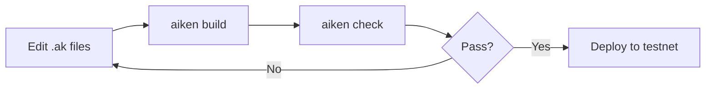

# Getting Started with UltraLife Protocol

This guide will help you set up your development environment and start building with the UltraLife Protocol.

## Table of Contents

1. [Prerequisites](#prerequisites)
2. [Installation](#installation)
3. [Project Structure](#project-structure)
4. [Building Contracts](#building-contracts)
5. [Running Tests](#running-tests)
6. [MCP Service Setup](#mcp-service-setup)
7. [Local Development](#local-development)
8. [Common Tasks](#common-tasks)
9. [Troubleshooting](#troubleshooting)

---

## Prerequisites

### Required Software

| Software | Version | Purpose |
|----------|---------|---------|
| Aiken | 1.1.0+ | Smart contract compiler |
| Node.js | 18+ | MCP service runtime |
| npm | 9+ | Package management |
| Git | 2.x | Version control |

### Optional but Recommended

| Software | Purpose |
|----------|---------|
| Blockfrost API Key | Chain indexing (get at blockfrost.io) |
| Cardano Node | Local testing |
| Ogmios | Transaction submission |

### Installing Aiken

```bash
# macOS/Linux
curl -sSfL https://install.aiken-lang.org | bash

# Verify installation
aiken --version
```

For other installation methods, see [aiken-lang.org](https://aiken-lang.org).

---

## Installation

### Clone the Repository

```bash
git clone https://github.com/ultralife/protocol.git
cd ultralife-protocol
```

### Install Dependencies

```bash
# Install Aiken dependencies
cd contracts
aiken deps

# Install MCP service dependencies
cd ../service
npm install
```

---

## Project Structure

```
ultralife-protocol/
├── contracts/                  # Aiken smart contracts
│   ├── validators/            # 27 validator scripts
│   │   ├── pnft.ak           # Personal NFT (identity)
│   │   ├── token.ak          # Token transfer logic
│   │   ├── treasury.ak       # External value bridge
│   │   ├── bioregion.ak      # Geographic organization
│   │   ├── governance.ak     # Voting and proposals
│   │   ├── ubi.ak            # Universal basic income
│   │   ├── impact.ak         # Impact token creation
│   │   ├── marketplace.ak    # Listings and purchases
│   │   └── ...               # 19 more validators
│   ├── lib/ultralife/        # Shared libraries
│   │   ├── types.ak          # Core type definitions
│   │   ├── helpers.ak        # Utility functions
│   │   └── prc37.ak          # 37-day cycle functions
│   ├── tests/                # Test suites
│   └── aiken.toml            # Project configuration
├── docs/                     # Documentation (30+ files)
├── service/                  # MCP service
│   ├── src/
│   │   ├── indexer/         # Blockfrost chain reader
│   │   ├── builder/         # Transaction construction
│   │   └── mcp/             # LLM interface (31 tools)
│   ├── package.json
│   └── tsconfig.json
├── scripts/                  # Deployment utilities
└── README.md
```

---

## Building Contracts

### Build All Validators

```bash
cd contracts
aiken build
```

This compiles all 27 validators and outputs Plutus scripts to `contracts/plutus.json`.

### Build Output

```bash
# Check compilation output
ls -la plutus.json

# View validator hashes
aiken blueprint policy
```

### Verify Build

```bash
# Run static analysis
aiken check

# Run formatter
aiken fmt --check
```

---

## Running Tests

### Run All Tests

```bash
cd contracts
aiken check
```

### Run Specific Test Files

```bash
# Test identity validators
aiken check tests/pnft_test.ak

# Test economic validators
aiken check tests/token_test.ak tests/treasury_test.ak
```

### Test Coverage

```bash
aiken check --trace-level verbose
```

---

## MCP Service Setup

The MCP (Model Context Protocol) service enables LLM assistants to interact with the protocol.

### Configuration

Create a `.env` file in the `service/` directory:

```bash
# Required
BLOCKFROST_PROJECT_ID=your_project_id_here
NETWORK=preview  # or mainnet, preprod

# Optional
PORT=3000
LOG_LEVEL=info
```

### Start the Service

```bash
cd service
npm start
```

### Development Mode

```bash
npm run dev  # Hot reload enabled
```

### Connect to Claude Desktop

Add to your Claude Desktop MCP configuration:

```json
{
  "mcpServers": {
    "ultralife": {
      "command": "node",
      "args": ["/path/to/ultralife-protocol/service/dist/index.js"],
      "env": {
        "BLOCKFROST_PROJECT_ID": "your_project_id"
      }
    }
  }
}
```

---

## Local Development

### Development Workflow



### Recommended IDE Setup

**VS Code Extensions:**
- Aiken Language Support
- Mermaid Preview (for diagrams)

**Settings:**
```json
{
  "editor.formatOnSave": true,
  "aiken.formatOnSave": true
}
```

### Working with Types

The core types are defined in `lib/ultralife/types.ak`. Key types to understand:

```aiken
// Identity
pub type PnftDatum {
  pnft_id: ByteArray,
  owner: VerificationKeyHash,
  level: VerificationLevel,
  bioregion: Option<ByteArray>,
  // ...
}

// Verification levels
pub type VerificationLevel {
  Basic           // Wallet only
  Ward            // Guardian-linked
  Standard        // DNA verified
  Verified        // + Bioregion proof
  Steward         // + Community endorsement
}

// Compound tracking
pub type CompoundFlow {
  compound: CompoundCode,
  quantity: Int,           // Positive = released, Negative = sequestered
  unit: MassUnit,
  measurement: MeasurementMethod,
  confidence: Int,
}
```

### Working with Helpers

Import common utilities from `lib/ultralife/helpers.ak`:

```aiken
use ultralife/helpers.{
  find_pnft_in_inputs,
  pnft_owner_signed,
  level_at_least,
  get_current_slot,
}

// Example: Verify pNFT ownership
fn validate_pnft_owner(ctx: ScriptContext) -> Bool {
  let pnft = find_pnft_in_inputs(ctx.transaction.inputs)
  pnft_owner_signed(pnft, ctx.transaction.extra_signatories)
}
```

### Working with Cycles

The 37-day cycle is fundamental. Use `lib/ultralife/prc37.ak`:

```aiken
use ultralife/prc37.{
  current_cycle,
  cycle_start,
  cycle_end,
  in_cycle,
  CYCLE_SLOTS,  // 3,196,800
}

// Example: Check if in current cycle
fn is_current_cycle(slot: Int, target_cycle: Int) -> Bool {
  let now_cycle = current_cycle(slot)
  now_cycle == target_cycle
}
```

---

## Common Tasks

### Creating a New Validator

1. Create file in `contracts/validators/`:

```aiken
// validators/my_validator.ak
use aiken/transaction.{ScriptContext}
use ultralife/types.{MyDatum, MyRedeemer}
use ultralife/helpers

validator my_validator {
  spend(
    datum: Option<MyDatum>,
    redeemer: MyRedeemer,
    _own_ref: Data,
    ctx: ScriptContext,
  ) {
    // Your validation logic
    True
  }
}
```

2. Add types to `lib/ultralife/types.ak` if needed

3. Build and test:

```bash
aiken build
aiken check
```

### Querying Chain State

Use the MCP service indexer:

```typescript
// service/src/indexer/pnft.ts
import { BlockfrostProvider } from './provider';

export async function getPnft(pnftId: string) {
  const utxo = await provider.getUtxoByAsset(PNFT_POLICY_ID, pnftId);
  return parsePnftDatum(utxo.datum);
}
```

### Building a Transaction

Use the MCP service builder:

```typescript
// service/src/builder/transfer.ts
import { TransactionBuilder } from './base';

export function buildTransfer(params: TransferParams) {
  return new TransactionBuilder()
    .addInput(senderUtxo)
    .addOutput(recipientAddress, params.amount)
    .attachDatum(transferDatum)
    .setRedeemer(transferRedeemer)
    .build();
}
```

### Adding an MCP Tool

1. Define tool in `service/src/mcp/tools/`:

```typescript
// service/src/mcp/tools/my_tool.ts
export const myTool: Tool = {
  name: 'my_tool',
  description: 'Does something useful',
  inputSchema: {
    type: 'object',
    properties: {
      param1: { type: 'string' },
    },
    required: ['param1'],
  },
  handler: async (params) => {
    // Implementation
    return { result: 'success' };
  },
};
```

2. Register in `service/src/mcp/server.ts`

---

## Troubleshooting

### Build Errors

**"Unknown type" error:**
```bash
# Ensure types.ak is imported
use ultralife/types.{TypeName}
```

**"Unbound variable" error:**
```bash
# Check imports in your validator
use ultralife/helpers.{function_name}
```

### Test Failures

**"Validation failed" in tests:**
```bash
# Run with verbose tracing
aiken check --trace-level verbose

# Check specific test
aiken check tests/my_test.ak --trace-level verbose
```

### MCP Service Issues

**"Blockfrost connection failed":**
```bash
# Verify API key
curl -H "project_id: $BLOCKFROST_PROJECT_ID" \
  https://cardano-preview.blockfrost.io/api/v0/

# Check network matches key (mainnet vs preview vs preprod)
```

**"Tool not found" in Claude:**
```bash
# Rebuild service
npm run build

# Check MCP config path
cat ~/.config/claude/mcp_servers.json
```

### Common Gotchas

1. **Compound quantities are signed**: Positive = released, negative = sequestered
2. **Slots vs time**: 37 days = 3,196,800 slots (1 slot = 1 second)
3. **Verification levels are ordered**: Basic < Ward < Standard < Verified < Steward
4. **pNFTs are non-transferable**: Owner field is immutable after creation
5. **All token transfers require impact**: Empty impact declaration is invalid

---

## Next Steps

1. Read [Architecture](ARCHITECTURE.md) for system design overview
2. Review [API Reference](API.md) for transaction formats
3. Study validators in `contracts/validators/` (start with `pnft.ak` and `token.ak`)
4. Explore the [existing documentation](../README.md) for conceptual understanding

## Getting Help

- **Documentation**: All 30+ docs in the `docs/` directory
- **Code Comments**: Validators include inline documentation
- **Types**: `lib/ultralife/types.ak` is the source of truth

---

## Appendix: Validator Quick Reference

| Validator | File | Key Types | Key Functions |
|-----------|------|-----------|---------------|
| pNFT | `pnft.ak` | `PnftDatum`, `PnftRedeemer` | `mint`, `upgrade` |
| Token | `token.ak` | `TransferDatum`, `TransactionType` | `transfer` |
| Treasury | `treasury.ak` | `TreasuryDatum` | `buy`, `sell` |
| Bioregion | `bioregion.ak` | `BioregionDatum` | `create`, `update` |
| Governance | `governance.ak` | `ProposalDatum`, `Vote` | `propose`, `vote`, `execute` |
| UBI | `ubi.ak` | `UbiPoolDatum`, `UbiClaimDatum` | `claim` |
| Impact | `impact.ak` | `ImpactDatum`, `CompoundFlow` | `mint`, `retire` |
| Marketplace | `marketplace.ak` | `ListingDatum` | `list`, `buy`, `cancel` |
| Work Auction | `work_auction.ak` | `WorkRequest`, `Bid` | `post`, `bid`, `accept` |
| Records | `records.ak` | `AvatarCycleStats` | `record`, `aggregate` |
