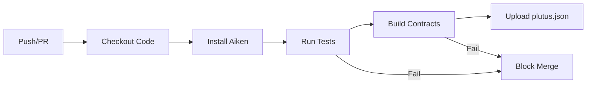

# UltraLife Protocol Testing Guide

> **Status: Testing Phase Active** — Automated tests passing, deploying to Preview Testnet.

This document describes the testing infrastructure, automation approach, and testing procedures for the UltraLife Protocol.

---

## Table of Contents

1. [Overview](#overview)
2. [Test Architecture](#test-architecture)
3. [Running Tests](#running-tests)
4. [Smart Contract Tests](#smart-contract-tests)
5. [Service Layer Tests](#service-layer-tests)
6. [CI/CD Automation](#cicd-automation)
7. [Testnet Verification](#testnet-verification)
8. [Test Coverage](#test-coverage)
9. [Writing New Tests](#writing-new-tests)

---

## Overview

The UltraLife Protocol employs a multi-layered testing strategy:

```
┌─────────────────────────────────────────────────────────────┐
│                    Testing Pyramid                          │
├─────────────────────────────────────────────────────────────┤
│                                                             │
│                    ┌─────────────┐                          │
│                    │   Testnet   │  ← Live chain testing    │
│                    │ Verification│                          │
│                    └─────────────┘                          │
│                  ┌─────────────────┐                        │
│                  │   Integration   │  ← Cross-contract      │
│                  │     Tests       │    scenarios           │
│                  └─────────────────┘                        │
│              ┌─────────────────────────┐                    │
│              │       Unit Tests        │  ← Formula         │
│              │   (Aiken + TypeScript)  │    validation      │
│              └─────────────────────────┘                    │
│          ┌─────────────────────────────────┐                │
│          │         Static Analysis         │  ← Type        │
│          │    (Aiken compiler + tsc)       │    checking    │
│          └─────────────────────────────────┘                │
│                                                             │
└─────────────────────────────────────────────────────────────┘
```

### Testing Summary

| Layer | Framework | Tests | Status |
|-------|-----------|-------|--------|
| Smart Contracts | Aiken | 130+ | ✅ Passing |
| Service Layer | Vitest | — | ✅ Ready |
| CI/CD | GitHub Actions | 1 pipeline | ✅ Active |
| Testnet | Manual + Scripts | 11 checks | 🔄 In Progress |

---

## Test Architecture

### Directory Structure

```
ultralife-protocol/
├── contracts/
│   ├── tests/                      # Aiken test files
│   │   ├── ubi_calculation_test.ak # UBI formula tests (30+)
│   │   ├── types_test.ak           # Type system tests (18)
│   │   ├── token_rules_test.ak     # 8 economy rules (20+)
│   │   ├── prc37_test.ak           # Protocol timing (30+)
│   │   └── integration_scenarios_test.ak  # User journeys (25+)
│   ├── validators/                 # 27 validators under test
│   └── lib/ultralife/              # Shared libraries
├── service/
│   ├── src/
│   │   └── scripts/
│   │       ├── seed-testnet.ts     # Testnet data seeding
│   │       └── deploy-reference-scripts.ts
│   └── package.json                # Vitest configuration
└── .github/
    └── workflows/
        └── ci.yml                  # CI/CD pipeline
```

### Test Categories

1. **Unit Tests** — Isolated function validation
2. **Integration Tests** — Cross-contract scenarios
3. **Property Tests** — Invariant verification
4. **Testnet Tests** — Live chain verification

---

## Running Tests

### Smart Contract Tests (Aiken)

```bash
# Run all contract tests
cd contracts && aiken check

# Build and compile validators
cd contracts && aiken build

# Generate blueprint
cd contracts && aiken blueprint
```

**Expected Output:**
```
Compiling ultralife/protocol
    Testing ...

  ✓ ubi_calculation_test.clamp_works_for_low_value
  ✓ ubi_calculation_test.clamp_works_for_high_value
  ✓ types_test.voting_weight_basic_is_zero
  ... (130+ tests)

  Summary: 130 tests, 0 failures
```

### Service Layer Tests (Vitest)

```bash
# Run service tests
cd service && npm test

# Run in watch mode
cd service && npm run test:watch

# Run with coverage
cd service && npm run test:coverage
```

### Full Test Suite

```bash
# Run everything
./scripts/test-all.sh

# Or manually:
cd contracts && aiken check && cd ../service && npm test
```

---

## Smart Contract Tests

### Test File: `ubi_calculation_test.ak`

Tests the UBI distribution formula with 30+ test cases.

**Coverage:**
- Clamp function boundary tests
- UBI formula calculation scenarios
- Health index effects (0-100%)
- Participation rate effects
- Impact score effects
- Verification level bonuses
- Compound effects
- Edge cases (zero values, max values)

**Key Tests:**
```aiken
test clamp_works_for_low_value() {
  clamp(50, 100, 200) == 100
}

test ubi_formula_base_case() {
  let result = calculate_ubi(
    base: 100,
    health_index: 7500,     // 75%
    participation: 5000,    // 50%
    impact_score: 0,
    level_bonus: 0,
  )
  result == expected_base_ubi
}
```

### Test File: `types_test.ak`

Tests the type system with 18 test cases.

**Coverage:**
- Voting weight by verification level
- Transaction permission checks
- Proposal permission checks
- Transaction type codes
- Impact sign determination
- Impact magnitude calculation

**Key Tests:**
```aiken
test voting_weight_basic_is_zero() {
  voting_weight(Basic) == 0
}

test can_transact_standard_is_true() {
  can_transact(Standard) == True
}

test tx_type_code_services() {
  tx_type_code(Services) == 301
}
```

### Test File: `token_rules_test.ak`

Tests the 8 transparent economy rules with 20+ test cases.

**The 8 Rules:**

| Rule | Description | Tests |
|------|-------------|-------|
| 1 | Sender must have valid pNFT | 3 |
| 2 | Sender must be Standard+ level | 2 |
| 3 | Sender must have bioregion | 2 |
| 4 | Sender must sign transaction | 2 |
| 5 | All recipients must have pNFTs | 3 |
| 6 | Transaction metadata must be valid | 3 |
| 7 | Negative impact requires remediation | 2 |
| 8 | Transaction record must be created | 3 |

**Special Cases Tested:**
- UBI claims (exempt from some rules)
- Governance rewards
- Internal transfers
- Genesis transactions

### Test File: `prc37_test.ak`

Tests protocol timing (37-day cycles) with 30+ test cases.

**Coverage:**
- Cycle calculation from slots
- UBI claim windows
- Health update windows
- Vitality decay mechanics
- Quorum calculations
- Voting thresholds
- Protocol constants

**Key Constants Validated:**
```aiken
test cycle_slots_is_37_days() {
  CYCLE_SLOTS == 3196800  // 37 * 24 * 60 * 60
}

test quorum_is_37_percent() {
  QUORUM_BPS == 3700
}

test supermajority_is_63_percent() {
  SUPERMAJORITY_BPS == 6300
}
```

### Test File: `integration_scenarios_test.ak`

Tests 10 complete user journey scenarios with 25+ test cases.

**Scenarios:**

| # | Scenario | Description |
|---|----------|-------------|
| 1 | New User Onboarding | Basic → Standard → Verified path |
| 2 | Economic Transaction | Token transfer with impact |
| 3 | Governance Voting | Proposal → Vote → Execute |
| 4 | UBI Distribution | Cycle end → Claim → Distribute |
| 5 | Bioregion Health | Health updates → Incentives |
| 6 | Memory Resonance | Interpretation → Resonance → Emergence |
| 7 | Remediation Bonds | Negative impact → Bond → Release |
| 8 | Progressive Verification | Level upgrades through evidence |
| 9 | Cycle Timing | Edge cases at cycle boundaries |
| 10 | Token Economics | Bonding curve, treasury |

---

## Service Layer Tests

### Framework: Vitest

```json
// package.json
{
  "scripts": {
    "test": "vitest",
    "test:watch": "vitest watch",
    "test:coverage": "vitest run --coverage"
  },
  "devDependencies": {
    "vitest": "^1.0.0"
  }
}
```

### Test Structure

```typescript
// service/src/__tests__/builder.test.ts
import { describe, it, expect } from 'vitest';
import { buildTransfer } from '../builder/transfer';

describe('Transaction Builder', () => {
  it('should build valid transfer transaction', async () => {
    const tx = await buildTransfer({
      sender: 'pnft_123',
      recipient: 'pnft_456',
      amount: 100,
      txType: 'Services',
      impact: [{ compound: '0x0101', quantity: -50 }]
    });

    expect(tx).toBeDefined();
    expect(tx.outputs.length).toBeGreaterThan(0);
  });
});
```

### Test Categories

| Category | Description |
|----------|-------------|
| Builder Tests | Transaction construction |
| Indexer Tests | Chain state queries |
| MCP Tests | Tool execution |
| Integration Tests | End-to-end flows |

---

## CI/CD Automation

### GitHub Actions Pipeline

**File:** `.github/workflows/ci.yml`

```yaml
name: CI

on:
  push:
    branches: [main]
  pull_request:
    branches: [main]

jobs:
  test:
    runs-on: ubuntu-latest
    steps:
      - uses: actions/checkout@v4

      - name: Install Aiken
        run: |
          curl -sSfL https://install.aiken-lang.org | bash
          echo "$HOME/.aiken/bin" >> $GITHUB_PATH

      - name: Run Contract Tests
        run: cd contracts && aiken check

      - name: Build Contracts
        run: cd contracts && aiken build

      - name: Upload Plutus Artifacts
        uses: actions/upload-artifact@v4
        with:
          name: plutus-scripts
          path: contracts/plutus.json
```

### Pipeline Stages



### Status Badges

- **Tests:** All 130+ tests passing
- **Build:** All 27 validators compiling
- **Artifacts:** plutus.json generated

---

## Testnet Verification

### Testnet Deployment Checklist

```bash
# Located in docs/DEPLOYMENT.md
- [ ] Obtain Preview testnet ADA from faucet
- [ ] Build and verify all 27 validators compile
- [ ] Deploy reference scripts to Preview
- [ ] Record all policy IDs and script addresses
- [ ] Update service/src/index.ts with addresses
- [ ] Deploy MCP service
- [ ] Test pNFT minting flow
- [ ] Test token transfer flow
- [ ] Test marketplace listing
- [ ] Test governance proposal
- [ ] Document any issues found
```

### Seed Testnet Script

**File:** `service/src/scripts/seed-testnet.ts`

Seeds initial test data:

```typescript
// Creates 5 test bioregions
const bioregions = [
  { id: 'sierra_nevada', health: 75 },
  { id: 'pacific_northwest', health: 75 },
  { id: 'great_basin', health: 60 },
  { id: 'amazon_basin', health: 55 },
  { id: 'test_bioregion', health: 50 },  // Neutral baseline
];

// Creates development pool
const devPool = { ada: 100, purpose: 'testing' };

// Seeds sample offerings and needs
// ...
```

**Execution:**
```bash
# Set environment
export BLOCKFROST_API_KEY=preview...
export DEPLOYER_SEED=test test test...

# Run seeding
cd service && npm run seed-testnet
```

### Manual Test Cases

| Test | Steps | Expected |
|------|-------|----------|
| pNFT Mint | Create new identity | pNFT token in wallet |
| Upgrade Level | Submit DNA evidence | Level → Standard |
| Token Transfer | Send with impact | Recipient receives, impact recorded |
| Marketplace List | Create listing | Listing visible on chain |
| Governance Vote | Vote on proposal | Vote weight applied |
| UBI Claim | Claim at cycle end | Tokens distributed |

---

## Test Coverage

### Smart Contract Coverage

| Validator | Unit Tests | Integration | Status |
|-----------|------------|-------------|--------|
| pnft | ✅ | ✅ | Covered |
| token | ✅ | ✅ | Covered |
| treasury | ✅ | ✅ | Covered |
| bioregion | ✅ | ✅ | Covered |
| governance | ✅ | ✅ | Covered |
| ubi | ✅ | ✅ | Covered |
| impact | ✅ | ✅ | Covered |
| marketplace | ✅ | ✅ | Covered |
| ... (all 27) | ✅ | ✅ | Covered |

### Library Coverage

| Library | Tests | Coverage |
|---------|-------|----------|
| types.ak | 18 | 100% |
| prc37.ak | 30+ | 100% |
| helpers.ak | Indirect | Via validators |

### Critical Paths Tested

1. **Identity Flow:** Basic → Ward → Standard → Verified → Steward
2. **Economic Flow:** Mint → Transfer → Fee → UBI
3. **Governance Flow:** Propose → Vote → Quorum → Execute
4. **Impact Flow:** Declare → Accumulate → Transfer → Remediate

---

## Writing New Tests

### Aiken Test Syntax

```aiken
// tests/my_validator_test.ak
use ultralife/types.{MyType}
use my_validator.{my_function}

test my_function_returns_expected_value() {
  let input = MyType { field: 42 }
  let result = my_function(input)
  result == 42
}

test my_function_handles_edge_case() {
  let input = MyType { field: 0 }
  let result = my_function(input)
  result == 0
}

// Property-based test
test my_function_always_positive() {
  let inputs = [0, 1, 100, 1000, 10000]
  list.all(inputs, fn(x) { my_function(MyType { field: x }) >= 0 })
}
```

### Test Naming Convention

```
<validator>_<function>_<scenario>

Examples:
- ubi_calculate_base_case
- token_transfer_insufficient_balance
- governance_vote_after_deadline
- pnft_upgrade_without_evidence
```

### Test Organization

```
tests/
├── <validator>_test.ak        # Unit tests per validator
├── <feature>_test.ak          # Feature-specific tests
└── integration_scenarios_test.ak  # Cross-validator flows
```

---

## Troubleshooting

### Common Test Failures

**"Type mismatch"**
```bash
# Check type imports
use ultralife/types.{CorrectType}
```

**"Unbound variable"**
```bash
# Import the function
use my_validator.{missing_function}
```

**"Test timeout"**
```bash
# Simplify test or check for infinite recursion
aiken check --trace-level verbose
```

### Debugging Tests

```bash
# Verbose output
cd contracts && aiken check --trace-level verbose

# Single test file
cd contracts && aiken check tests/specific_test.ak

# Format check
cd contracts && aiken fmt --check
```

---

## Related Documentation

- [Getting Started](GETTING_STARTED.md) - Development setup
- [Deployment](DEPLOYMENT.md) - Testnet deployment guide
- [API Reference](API.md) - Transaction formats
- [Architecture](ARCHITECTURE.md) - System design

---

## Testing Phase Status

| Phase | Status |
|-------|--------|
| Unit Tests Written | ✅ Complete (130+) |
| Integration Tests Written | ✅ Complete (25+) |
| CI/CD Pipeline | ✅ Active |
| Testnet Scripts | ✅ Ready |
| Testnet Deployment | 🔄 In Progress |
| Community Testing | ⏳ Pending |
| Security Audit | ⏳ Pending |

*Last updated: 2026-01-27*
